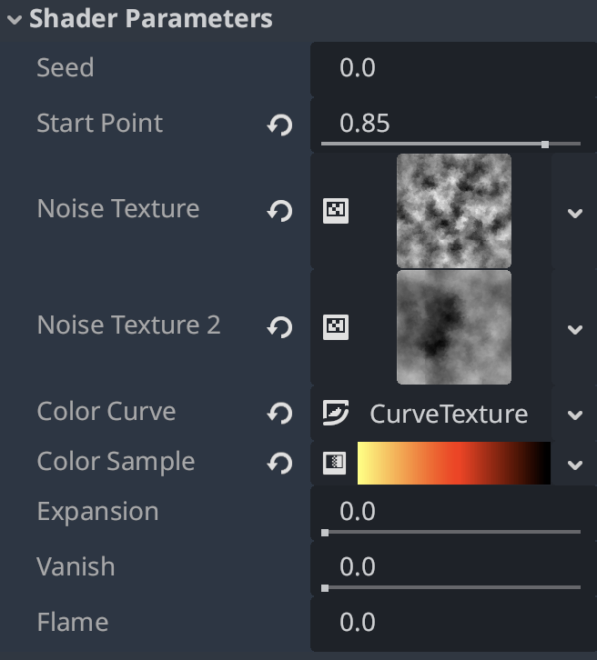

# Godot 2D explosion shader
A simple Godot 2D realistic explosion shader based on Perlin noise.

Support for Godot4x

HDR 2D is recommended to be enabled to achieve the best effect

## Usage

These are parameters used to control the process of explosion. Change their values to make the explosion proceed.

- `expansion`: Control the expansion of the explosion. Increase this value from 0.0 to 1.0 will make the flame expand from the `start_point`.
- `vanish`: Control the vanishment of the explosion. Increase this value from 0.0 to 1.0 will make the flame disappear uniformly.
- `flame`: Control the effect of the flame burning upwards. Increase this value will make the flame texture move upwards.

Others are properties. Change them only when you want to modify the explosion effect.

- `seed`: Change the seed will change the shape and the texture of the explosion. You can randomize the seed every time before starting the explosion to make them look different.
- `start_point`: Control the y coordinate of the start point of the explosion.
- `noise_texture` and `noise_texture2`: The Perlin noise texture used to generate the texture and decide the rendered color.
- `color_curve`: Control the color distribution.
- `color_sample`: The color of the explosion. The color gradient will be applied based on the color of the noise and the `color_curve`.

The effect is used in the game: https://store.steampowered.com/app/3353900/COLD_BOOT/
